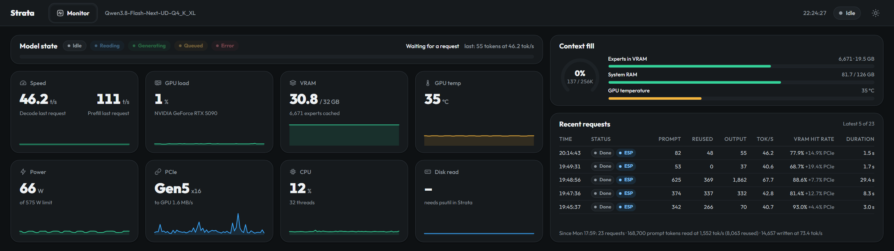
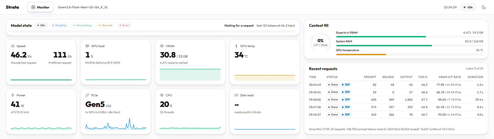

# Strata Edge 0.1.5

[日本語](README.md) | [English](README.en.md)

A community iCUE widget that adapts the official Strata v0.1.39 Web UI **Monitor** for CORSAIR XENEON EDGE (2560×720). Created by rvhfxb. This is not an official Strata or CORSAIR product.

[Download the release](https://github.com/rvhfxb/xeneon-edge-strata-widget/releases/tag/v0.1.5). For a first installation, use the ZIP containing the helper. If you already have a compatible helper, use the `.icuewidget` file. GitHub's “Source code” ZIP contains development sources.

## Screenshots

Browser previews at 2560×720, captured with v0.1.5 and real monitoring data. For publication, the model display name is replaced with `Qwen3.8-Flash-Next-UD-Q4_K_XL`, the downloaded GGUF filename with the shard number and extension omitted. These are not photographs of the XENEON EDGE display. While idle, speed numbers show the last request; graphs show the official 60-second history.

**Dark**



**Light**



## Requirements

- Windows 11, XENEON EDGE, and iCUE 5.51 or later.
- Node.js 22 or later available on PATH. Node.js is not included in the ZIP.
- Strata running on the same PC. Tested with v0.1.39 using the `/health` and `/metrics` APIs. The default upstream address is `http://127.0.0.1:8086`.
- Monitoring APIs that do not require an API key. Authenticated connections are not supported in this version.

## First installation

1. Extract `strata-edge-0.1.5.zip` into a **writable folder that will remain in place**. Do not run it from inside the ZIP.
2. If Strata uses a port other than 8086, edit `strataUrl` in `helper.config.json`, for example `http://127.0.0.1:8080`. Configure one upstream server.
3. Run `Install-Helper.cmd`. It registers the `Strata Edge Helper` scheduled task for the current user, starts it now, and configures it to run hidden at logon.
4. Open `http://127.0.0.1:5199/` in a browser and check that the model name and state appear.
5. In iCUE's XENEON EDGE widget interface, import the included `strata-edge-0.1.5.icuewidget` and place it across the full display.

The CMD launchers use PowerShell's Bypass execution policy for that process only. They do not change the system-wide policy. If your organization prohibits script execution, follow its policy.

Importing the widget alone does not provide monitoring data: a helper must also be running. Use the release ZIP for a first installation. Keep the installation folder and Node.js location unchanged after installation.

## Using an existing Strata helper

You can reuse the older Strata Monitor's `XENEON EDGE Strata Helper` if it serves `127.0.0.1:5199/api/snapshot`. **Import only the icuewidget file; do not register another helper.** When sharing a helper, the browser preview on port 5199 is the existing helper's page.

To migrate to the new helper, run `Stop-Widget.ps1` in the existing installation folder, then disable the old task with `Disable-ScheduledTask -TaskName 'XENEON EDGE Strata Helper'` before installing the new version. Keep the old files. Running both helpers causes a port 5199 conflict. The new installer does not automatically stop existing tasks or other helpers.

## Display behavior

- Uses the official Outfit font, colors, cards, icons, labels, and calculations. CSS is checked against a pinned Strata v0.1.39 commit and hashes; only two font URLs in `tokens.css` are changed to use the bundled fonts. The 2048×576 CSS-pixel canvas scales by 1.25 at full resolution and proportionally for smaller areas.
- Model state and a four-column, two-row metrics grid are on the left. Context fill and Recent requests are on the right, showing the latest five requests that fit in the area, with up to 12 available.
- Displays Decode / Prefill, GPU load / VRAM / temperature / power / PCIe, CPU / Disk read, System RAM / Experts, context, requests, and totals. There is no server selector.
- **Speed numbers and graphs follow official v0.1.39 behavior.** Numbers show current values during processing and the last request's average while idle. Graphs show samples from the last 60 seconds; Prefill is zero when no prompt is being processed. A graph can therefore be zero while a speed number remains visible. Missing graph samples are also drawn as zero, matching the official UI.
- Starts in dark mode. Header theme changes are saved. Changing Theme in iCUE settings applies the new value; notifications with an unchanged setting do not override a header selection.
- Fetches data every two seconds. The helper sends only GET requests to `/health` and `/metrics`; it does not request model loading, unloading, or inference. Failed requests and data older than 10 seconds clear speed and other affected values to unavailable indicators.
- Context fill estimates input plus output occupancy, not actual KV memory usage. Memory uses the official 1024-based units. Disk read is unavailable if Strata's Python environment lacks psutil; this helper does not install it.

## Start, stop, update, and uninstall

- `Start-Helper.cmd`: Start manually. Re-enables this task if disabled. If the task is Running but the helper does not respond and its port is free, restarts it. Does not stop another process occupying the port.
- `Stop-Helper.cmd`: Stop the current run. Safe to repeat when already stopped or Disabled. The helper starts at the next logon if the task remains enabled.
- `Uninstall-Helper.cmd`: Stop and unregister the task belonging to this folder. Remove the widget separately in iCUE.
- Temporarily disable logon startup: run `Disable-ScheduledTask -TaskName 'Strata Edge Helper'`, then Stop. Use Start to restore it.
- After changing the upstream address: Stop → Start. Configuration is read when the helper starts.
- Update in the same folder: Stop → replace files with the new version → Install → import the new icuewidget. To move folders, Uninstall from the old folder before running Install in the new one.
- Recovery: stop and uninstall the new helper, then start the retained previous version from its original folder. To return to the older shared helper, use `Enable-ScheduledTask -TaskName 'XENEON EDGE Strata Helper'` and its `Start-Widget.ps1`.

Logs do not rotate automatically. The helper logs startup and errors, not per-request monitoring data. Check monthly, or when `helper-output.log` / `helper-error.log` exceeds 1 MiB. Stop the helper before archiving or deleting the logs, then Start it again.

These operations do not stop Strata itself. The task runs as the current user with Interactive / Limited privileges, starts at logon, and retries up to three times at one-minute intervals after failure.

## Troubleshooting

- `Server not reachable`: Check that Strata is running, inspect `helper.config.json`, and open `http://127.0.0.1:5199/api/snapshot`.
- `API key needed`: The monitoring API requires authentication, which this version does not support.
- Port 5199 conflict: reuse an existing compatible helper, or stop it using its own documented procedure.
- Startup failure: check `helper-error.log` / `helper-output.log` and `node --version` (22 or later required).
- `Model not loaded`: The helper is reachable, but Strata has no model loaded.

If `strataUrl` is missing or null, the default upstream on port 8086 is used. `localhost` is normalized to `127.0.0.1`. For IPv6, specify `http://[::1]:PORT` explicitly.

The helper listens only on `127.0.0.1:5199`. Upstream configuration also accepts only local HTTP origins using localhost / 127.0.0.1 / ::1. Do not include API paths or credentials in the URL, or store API keys or secrets in the configuration file.

## Licenses

This project: MIT (`LICENSE`). Strata-derived code, CSS, and icons: MIT (`widget/resources/STRATA-LICENSE.txt`). Outfit: SIL OFL 1.1 (`widget/resources/fonts/OFL.txt`). See `THIRD-PARTY-NOTICES.md` for details.

`SHA256SUMS.txt` inside the release ZIP lists the bundled file hashes. Verify the ZIP and icuewidget themselves with the separate `strata-edge-0.1.5-SHA256SUMS.txt` file.

## Validation and limitations — 2026-10-05

Verified Node helper HTTP tests, PowerShell syntax and mocked task operations, Chrome file:// state and theme regression checks, layouts at 2560×720 / 1280×360 / 736×207, official CLI 0.4.47 validate / package, ZIP contents, and matching hashes.

**Actual iCUE import, physical touch interaction, and automatic startup after Windows logon have not been verified for 0.1.5.** Creating release files does not update an existing helper or Strata installation.

The layout normally follows ResizeObserver and resize events. Only embedded browsers without ResizeObserver retain the one-second recalculation fallback previously found effective in iCUE.

## Development (source folder)

```powershell
npm ci
npm test
node scripts/test-upstream.cjs --upstream
powershell -NoProfile -ExecutionPolicy Bypass -File scripts/test-helper.ps1
npm run validate
npm run verify
powershell -NoProfile -ExecutionPolicy Bypass -File scripts/check.ps1 -OutDir C:\temp\strata-edge-check
npm run package
```

`verify-browser.cjs` uses Chrome and Node.js 22 or later to test fixture data. Layout diagnostics are injected through DevTools from a development script and are absent from the shipped `app.js`. `check.ps1` uses real data from an already-running helper. Development scripts and npm dependencies are excluded from the release ZIP.
